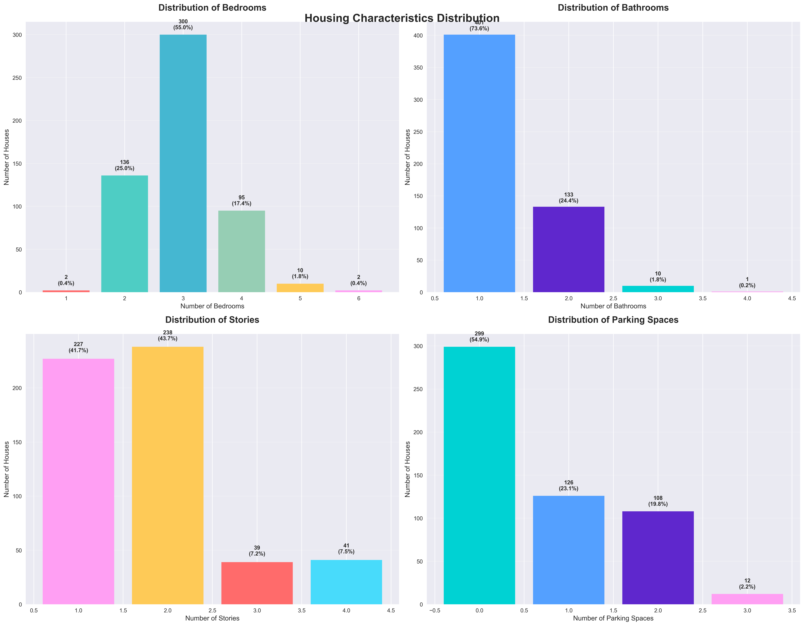
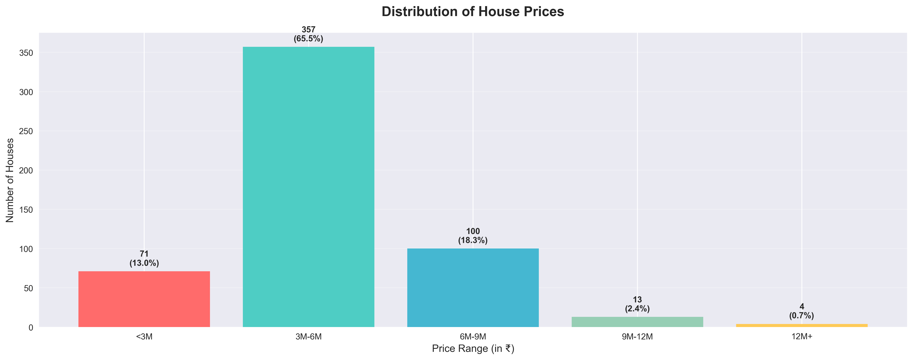
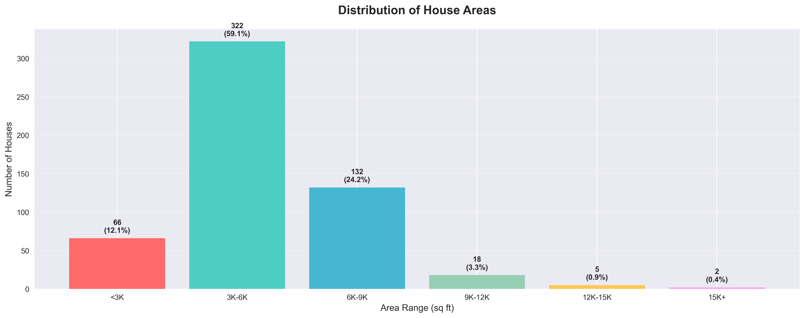

# Housing Data Analysis Project

## Project Structure
- `data/`: Contains the Housing.csv dataset
- `notebooks/`: Jupyter notebook for interactive analysis
- `scripts/`: Python script for automated analysis
- `output/`: Generated charts and visualizations

## Setup Instructions
1. Clone or download this project
2. Install required packages:
   ```bash
   pip install -r requirements.txt
   jupyter notebook notebooks/housing_analysis.ipynb
   python scripts/housing_analysis.py

## Result



